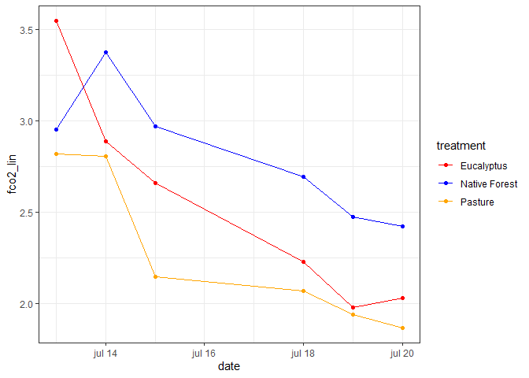
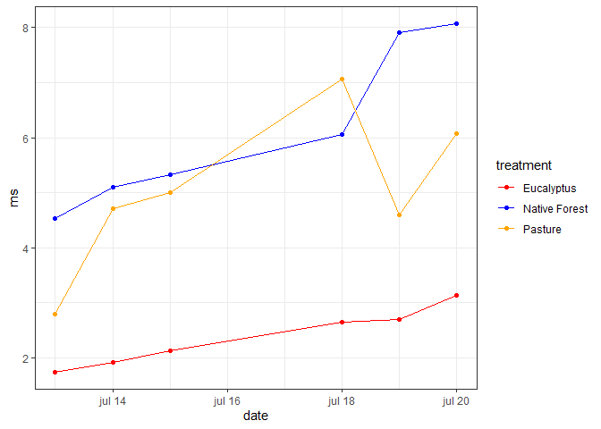
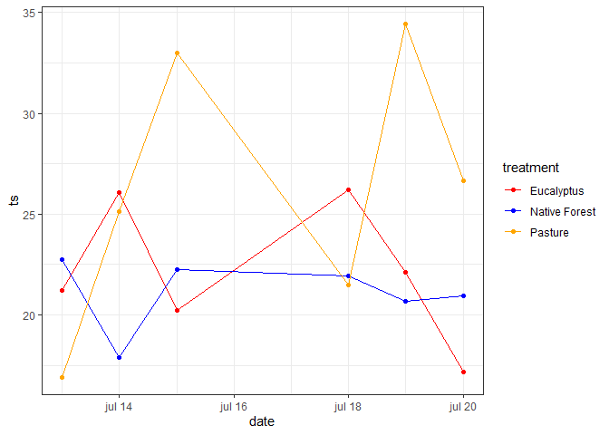
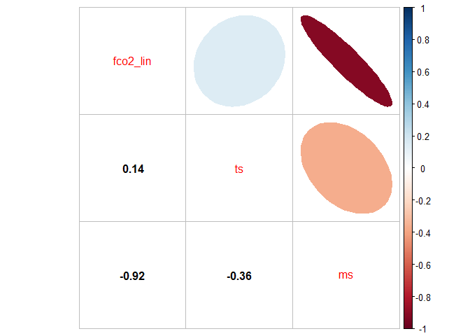
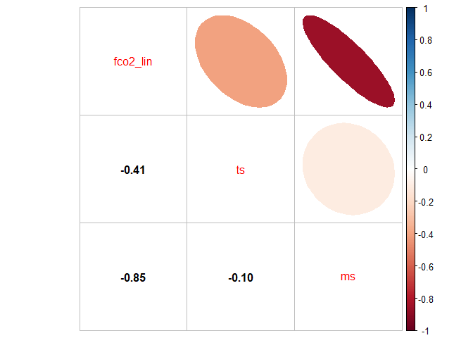
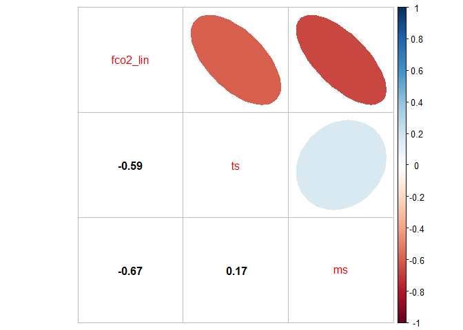
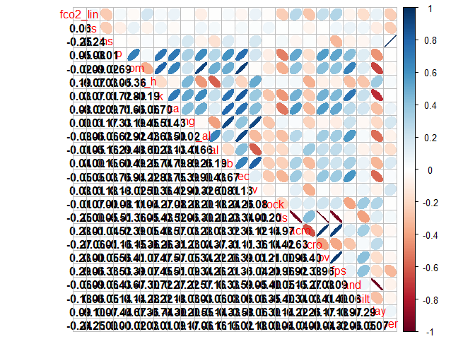
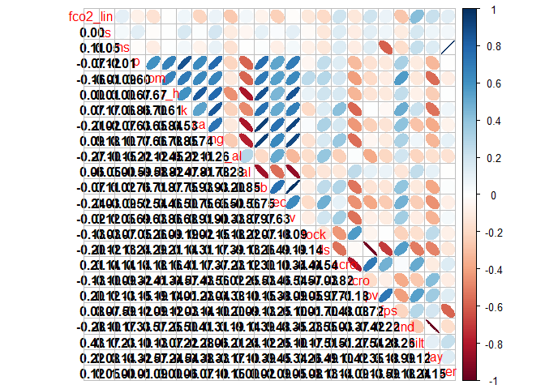
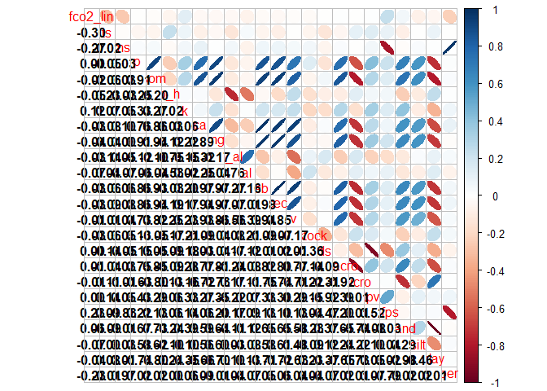

<!-- README.md is generated from README.Rmd. Please edit that file -->

``` r
knitr::opts_chunk$set(
  collapse = TRUE,
  warning = FALSE,
  error = FALSE,
  message = FALSE,
  comment = "#>"
)
```

# canteral-quali-2023

## 

``` r
library(tidyverse)
source("R/my-functions.R")
```

``` r
readxl::excel_sheets("data/Banco_dados.xlsx")
#>  [1] "LI-8100_Original"   "Clima"              "Eu_Mt_Pd"          
#>  [4] "FCO2"               "FO2"                "Ts"                
#>  [7] "Ms"                 "PCA1_0-10"          "PCA2_0-10"         
#> [10] "PCA1_10-20"         "PCA2_10-20"         "PCA1_20-40"        
#> [13] "PCA2_20-40"         "PCA1_10-40"         "PCA2_10-40"        
#> [16] "Heatmap_0-10"       "Heatmap_10-40"      "0-10"              
#> [19] "10-20"              "20-40"              "10-40"             
#> [22] "Cstock"             "Temporal"           "Correlações"       
#> [25] "Linhas_SE"          "Emissao_Total"      "Total_emissao"     
#> [28] "Stepwise"           "EGM_Original"       "EGM_Pinus_Original"
#> [31] "Pinus"              "Pinus_0-20"         "Pinus-20-40"       
#> [34] "Pinus_40-60"
```

``` r
eumtpd <- readxl::read_xlsx("data/Banco_dados.xlsx",
                  sheet = "Eu_Mt_Pd",
                na="NA") %>% 
  janitor::clean_names()
```

``` r
resumo(eumtpd,fco2_lin)
```

<!-- -->

``` r
resumo(eumtpd,ms)
```

<!-- -->

``` r
resumo(eumtpd,ts)
```

<!-- -->

``` r
eumtpd %>% filter(treatment == "Eucalyptus") %>% 
    group_by(treatment, date) %>%
    summarise(fco2_lin = mean(fco2_lin, na.rm=TRUE),
              ts = mean(ts, na.rm=TRUE),
              ms = mean(ms, na.rm=TRUE)) %>% 
  ungroup() %>% 
  select(-treatment, -date) %>% 
  cor() %>% corrplot::corrplot.mixed(upper = "ellipse",lower = "number",lower.col = "black")
```

<!-- -->

``` r
eumtpd %>% filter(treatment == "Native Forest") %>% 
    group_by(treatment, date) %>%
    summarise(fco2_lin = mean(fco2_lin, na.rm=TRUE),
              ts = mean(ts, na.rm=TRUE),
              ms = mean(ms, na.rm=TRUE)) %>% 
  ungroup() %>% 
  select(-treatment, -date) %>% 
  cor() %>% corrplot::corrplot.mixed(upper = "ellipse", lower = "number",lower.col = "black")
```

<!-- -->

``` r
eumtpd %>% filter(treatment == "Pasture") %>% 
    group_by(treatment, date) %>%
    summarise(fco2_lin = mean(fco2_lin, na.rm=TRUE),
              ts = mean(ts, na.rm=TRUE),
              ms = mean(ms, na.rm=TRUE)) %>% 
  ungroup() %>% 
  select(-treatment, -date) %>% 
  cor() %>% corrplot::corrplot.mixed(upper = "ellipse",lower = "number",lower.col = "black")
```

<!-- -->

``` r
eumtpd %>% filter(treatment == "Eucalyptus") %>% 
  group_by(treatment, date, depth) %>% 
  select(-(k_2:t1_2), -m, -fo2,-(rwc:insolacao)) %>% 
  ungroup() %>% 
  select(-(treatment:depth)) %>% 
  cor() %>% corrplot::corrplot.mixed(upper = "ellipse",lower = "number",lower.col = "black")
```

<!-- -->

``` r
eumtpd %>% filter(treatment == "Native Forest") %>% 
  group_by(treatment, date, depth) %>% 
  select(-(k_2:t1_2), -m, -fo2,-(rwc:insolacao)) %>% 
  ungroup() %>% 
  select(-(treatment:depth)) %>% 
  cor() %>% corrplot::corrplot.mixed(upper = "ellipse",lower = "number",lower.col = "black")
```

<!-- -->

``` r
eumtpd %>% filter(treatment == "Pasture") %>% 
  group_by(treatment, date, depth) %>% 
  select(-(k_2:t1_2), -m, -fo2,-(rwc:insolacao)) %>% 
  ungroup() %>% 
  select(-(treatment:depth)) %>% 
  cor() %>% corrplot::corrplot.mixed(upper = "ellipse",lower = "number",lower.col = "black")
```

<!-- -->
