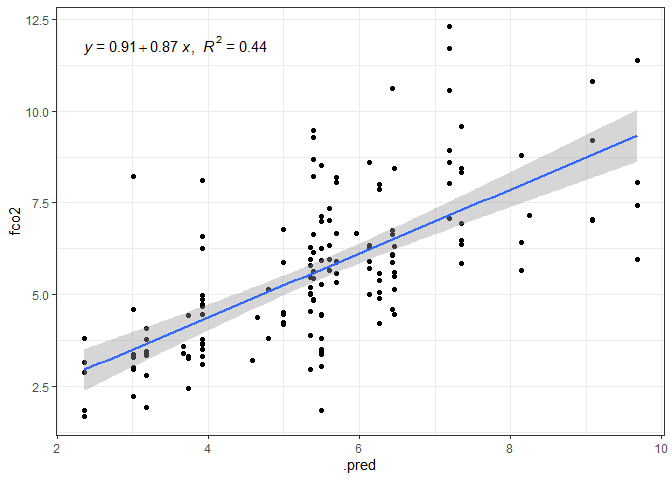
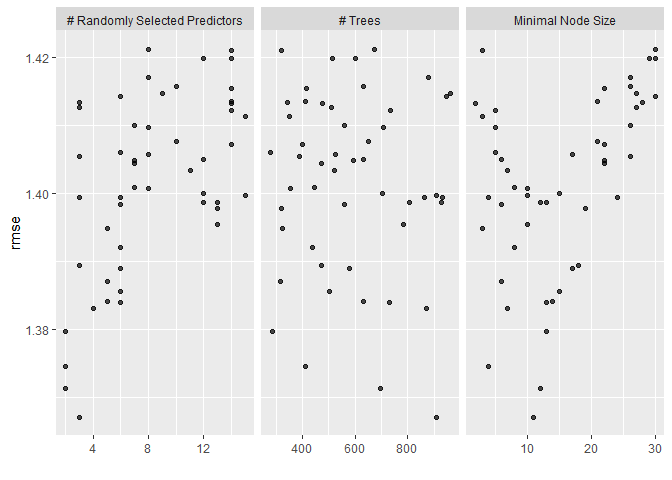
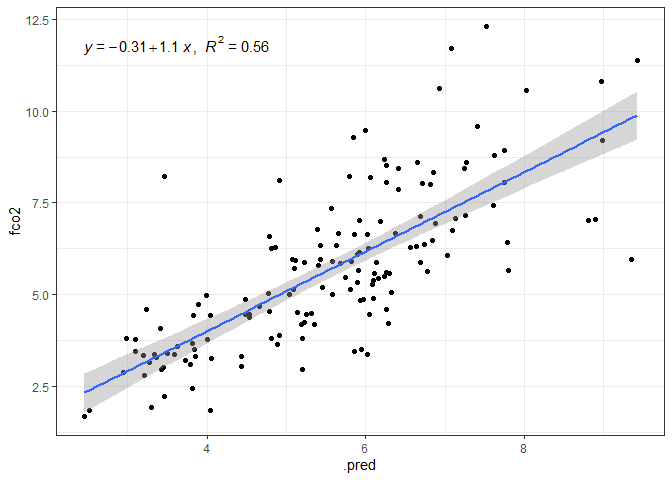
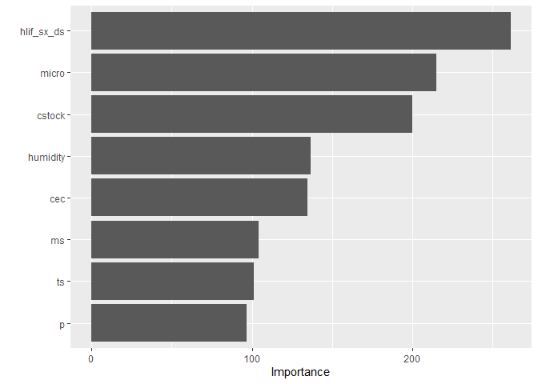
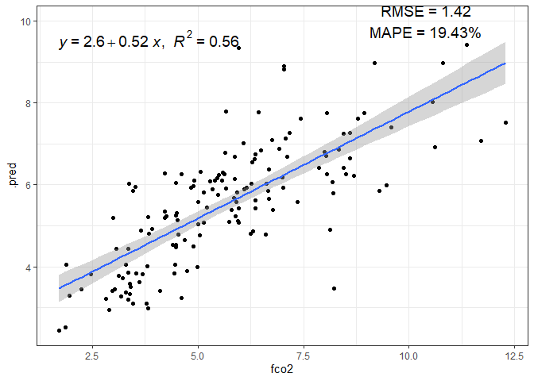
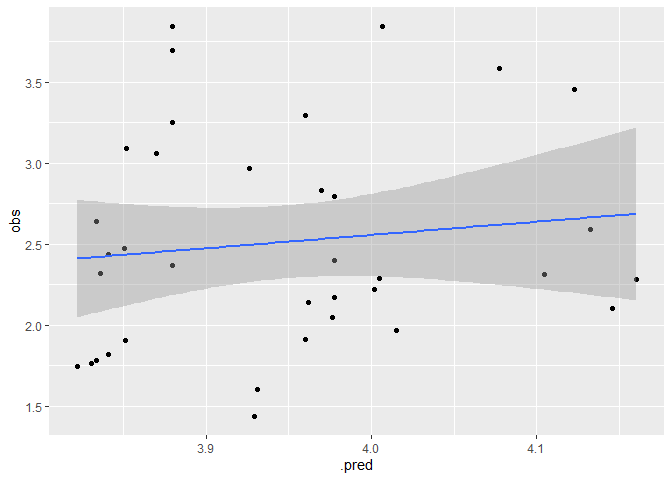

<!-- README.md is generated from README.Rmd. Please edit that file -->

``` r
knitr::opts_chunk$set(
  collapse = TRUE,
  warning = FALSE,
  error = FALSE,
  message = FALSE,
  comment = "#>"
)
```

# canteral-quali-2023

## 

``` r
library(tidyverse)
source("R/my-functions.R")
```

``` r
readxl::excel_sheets("data/Banco_dados.xlsx")
#>  [1] "LI-8100_Original"   "Clima"              "Eu_Mt_Pd"          
#>  [4] "FCO2"               "FO2"                "Ts"                
#>  [7] "Ms"                 "PCA1_0-10"          "PCA2_0-10"         
#> [10] "PCA1_10-20"         "PCA2_10-20"         "PCA1_20-40"        
#> [13] "PCA2_20-40"         "PCA1_10-40"         "PCA2_10-40"        
#> [16] "Heatmap_0-10"       "Heatmap_10-40"      "0-10"              
#> [19] "10-20"              "20-40"              "10-40"             
#> [22] "Cstock"             "Temporal"           "Correlações"       
#> [25] "Linhas_SE"          "Emissao_Total"      "Total_emissao"     
#> [28] "Stepwise"           "EGM_Original"       "EGM_Pinus_Original"
#> [31] "Pinus"              "Pinus_0-20"         "Pinus-20-40"       
#> [34] "Pinus_40-60"
```

``` r
eumtpd <- readxl::read_xlsx("data/Banco_dados.xlsx",
                  sheet = "Eu_Mt_Pd",
                na="NA") %>% 
  janitor::clean_names()
```

``` r
resumo(eumtpd,fco2_lin)
```

<!-- -->

``` r
resumo(eumtpd,ms)
```

<!-- -->

``` r
resumo(eumtpd,ts)
```

<!-- -->

``` r
eumtpd %>% filter(treatment == "Eucalyptus") %>% 
    group_by(treatment, date) %>%
    summarise(fco2_lin = mean(fco2_lin, na.rm=TRUE),
              ts = mean(ts, na.rm=TRUE),
              ms = mean(ms, na.rm=TRUE)) %>% 
  ungroup() %>% 
  select(-treatment, -date) %>% 
  cor() %>% corrplot::corrplot.mixed(upper = "ellipse",lower = "number",lower.col = "black")
```

<!-- -->

``` r
eumtpd %>% filter(treatment == "Native Forest") %>% 
    group_by(treatment, date) %>%
    summarise(fco2_lin = mean(fco2_lin, na.rm=TRUE),
              ts = mean(ts, na.rm=TRUE),
              ms = mean(ms, na.rm=TRUE)) %>% 
  ungroup() %>% 
  select(-treatment, -date) %>% 
  cor() %>% corrplot::corrplot.mixed(upper = "ellipse", lower = "number",lower.col = "black")
```

<!-- -->

``` r
eumtpd %>% filter(treatment == "Pasture") %>% 
    group_by(treatment, date) %>%
    summarise(fco2_lin = mean(fco2_lin, na.rm=TRUE),
              ts = mean(ts, na.rm=TRUE),
              ms = mean(ms, na.rm=TRUE)) %>% 
  ungroup() %>% 
  select(-treatment, -date) %>% 
  cor() %>% corrplot::corrplot.mixed(upper = "ellipse",lower = "number",lower.col = "black")
```

<!-- -->

``` r
eumtpd %>% filter(treatment == "Eucalyptus") %>% 
  group_by(treatment, date, depth) %>% 
  select(-(k_2:t1_2), -m, -fo2,-(rwc:insolacao)) %>% 
  ungroup() %>% 
  select(-(treatment:depth)) %>% 
  cor() %>% corrplot::corrplot.mixed(upper = "ellipse",lower = "number",lower.col = "black")
```

<!-- -->

``` r
eumtpd %>% filter(treatment == "Native Forest") %>% 
  group_by(treatment, date, depth) %>% 
  select(-(k_2:t1_2), -m, -fo2,-(rwc:insolacao)) %>% 
  ungroup() %>% 
  select(-(treatment:depth)) %>% 
  cor() %>% corrplot::corrplot.mixed(upper = "ellipse",lower = "number",lower.col = "black")
```

<!-- -->

``` r
eumtpd %>% filter(treatment == "Pasture") %>% 
  group_by(treatment, date, depth) %>% 
  select(-(k_2:t1_2), -m, -fo2,-(rwc:insolacao)) %>% 
  ungroup() %>% 
  select(-(treatment:depth)) %>% 
  cor() %>% corrplot::corrplot.mixed(upper = "ellipse",lower = "number",lower.col = "black")
```

<!-- -->

``` r
library(readxl)
library(tidyverse)
library(geobr)
library(skimr)
library(tidymodels)
library(ISLR)
library(modeldata)
library(vip)
library(ggpubr)
library(rpart.plot)
```

``` r
readxl::excel_sheets("data/Dados_mestrado_RF.xlsx")
#> [1] "RF_eu"          "RF_pi"          "RF_mt"          "RF_global"     
#> [5] "RF_eu_corr"     "RF_pi_corr"     "RF_mt_corr"     "RF_global_corr"
dados <- read_xlsx("data/Dados_mestrado_RF.xlsx",
                   sheet = "RF_eu_corr") %>% 
  janitor::clean_names()
glimpse(dados)
#> Rows: 500
#> Columns: 14
#> $ data          <dttm> 2015-11-07, 2015-11-07, 2015-11-07, 2015-11-07, 2015-11~
#> $ trat          <dbl> 1, 1, 1, 1, 1, 1, 1, 1, 1, 1, 1, 1, 1, 1, 1, 1, 1, 1, 1,~
#> $ id_ponto      <dbl> 1, 2, 3, 4, 5, 6, 7, 8, 9, 10, 11, 12, 13, 14, 15, 16, 1~
#> $ fco2          <dbl> 2.800, 3.330, 3.900, 4.370, 4.750, 4.970, 2.360, 4.085, ~
#> $ ts            <dbl> 27.1, 26.2, 26.4, 26.4, 26.1, 26.9, 26.5, 26.9, 27.1, 25~
#> $ ms            <dbl> 8, 8, 8, 8, 9, 9, 9, 11, 11, 10, 12, 9, 10, 11, 10, 13, ~
#> $ p             <dbl> 6, 4, 8, 6, 6, 5, 2, 4, 5, 3, 2, 6, 12, 8, 6, 7, 10, 9, ~
#> $ cec           <dbl> 91.3, 65.1, 98.9, 89.4, 81.7, 87.2, 63.7, 79.0, 82.1, 63~
#> $ hlif_sx_ds    <dbl> 48255.44, 43873.41, 49692.77, 61949.17, 50386.45, 50907.~
#> $ cstock        <dbl> 23.61608, 19.44854, 25.00526, 21.53231, 22.92149, 20.837~
#> $ nstock        <dbl> 1.78423651, 1.46091849, 0.63466131, 1.61659013, 1.892009~
#> $ micro         <dbl> 32.23659, 28.40745, 33.89543, 34.50749, 34.38169, 31.015~
#> $ humidity      <dbl> 71.94, 71.94, 71.94, 71.94, 71.94, 71.94, 71.94, 71.94, ~
#> $ precipitation <dbl> 0.15, 0.15, 0.15, 0.15, 0.15, 0.15, 0.15, 0.15, 0.15, 0.~
```

``` r
visdat::vis_miss(dados)
```

<!-- -->

``` r
data_set_ml <- dados
fco2_initial_split <- initial_split(data_set_ml, prop = 0.70)
```

``` r
fco2_train <- training(fco2_initial_split)
fco2_train  %>% 
  ggplot(aes(x=fco2, y=..density..))+
  geom_histogram(bins = 30, color="black",  fill="lightgray")+
  geom_density(alpha=.05,fill="red")+
  theme_bw() +
  labs(x="FCO2", y = "Densidade")
```

<!-- -->

## Data-prep

``` r
fco2_rf_recipe <- recipe(fco2 ~ ., data = fco2_train %>% 
                        select(-c(data:id_ponto,nstock,precipitation))
) %>%  
  step_normalize(all_numeric_predictors())  #%>% 
  #step_novel(all_nominal_predictors()) %>% 
  #step_zv(all_predictors()) %>%
  #step_naomit(c(Ts, Us)) %>% 
  #step_impute_mean(c(Us,Ts)) %>% 
  #step_poly(c(ms,ts), degree = 5)  
  #step_dummy(all_nominal_predictors())
bake(prep(fco2_rf_recipe), new_data = NULL)
#> # A tibble: 350 x 9
#>           ts      ms      p     cec hlif_sx_ds cstock   micro humidity  fco2
#>        <dbl>   <dbl>  <dbl>   <dbl>      <dbl>  <dbl>   <dbl>    <dbl> <dbl>
#>  1 -0.668    -0.832   1.44   1.54       -1.38   1.87  -0.983     0.319  4.61
#>  2  0.000956  0.878  -1.81  -1.73        2.14  -1.77   0.482     1.56   2.97
#>  3  0.383    -0.405   1.04   0.838      -0.947  1.14  -0.0119    0.319  7.65
#>  4 -0.955     0.878  -0.181 -0.339      -0.363  0.592  0.984     0.846  6.21
#>  5 -0.572     1.95   -0.587 -0.312       0.394 -0.864  0.372     0.846  3.92
#>  6  0.000956 -0.405  -1.81  -1.54        2.73  -2.14   0.791    -0.908  2.36
#>  7  0.000956  0.0229  0.631  0.0671     -0.830  0.228 -1.26     -0.420  5.85
#>  8 -0.190     1.09   -1.81  -1.54        2.73  -2.14   0.791    -1.29   3.75
#>  9  0.383     1.31   -0.587 -0.312       0.394 -0.864  0.372     0.472  4.08
#> 10 -0.381     0.451   1.04   0.838      -0.947  1.14  -0.0119    1.56  10.2 
#> # i 340 more rows
```

``` r
fco2_resamples_rf <- vfold_cv(fco2_train, v = 5)
grid <- grid_regular(
  penalty(range = c(-10, -2)),
  levels = 40
)
```

## Modelo Decision Tree

``` r
fco2_dt_model <- decision_tree(
  cost_complexity = tune(),
  tree_depth = tune(),
  min_n = tune()
)  %>%  
  set_mode("regression")  %>%  
  set_engine("rpart")
```

``` r
fco2_dt_recipe <- fco2_rf_recipe

fco2_dt_wf <- workflow()   %>%  
  add_model(fco2_dt_model) %>% 
  add_recipe(fco2_dt_recipe)
```

``` r
grid_dt <- grid_random(
  cost_complexity(c(-20, -1)),
  tree_depth(range = c(2, 30)),
  min_n(range = c(2, 60)),
  size = 5
)
```

``` r
fco2_dt_tune_grid <- tune_grid(
  fco2_dt_wf,
  resamples = fco2_resamples_rf,
  grid = grid_dt,
  metrics = metric_set(rmse)
)
autoplot(fco2_dt_tune_grid)
```

<!-- -->

``` r
collect_metrics(fco2_dt_tune_grid)
#> # A tibble: 5 x 9
#>   cost_complexity tree_depth min_n .metric .estimator  mean     n std_err
#>             <dbl>      <int> <int> <chr>   <chr>      <dbl> <int>   <dbl>
#> 1        4.27e-15         13    17 rmse    standard    1.51     5  0.0750
#> 2        1.01e- 2         29    15 rmse    standard    1.56     5  0.0877
#> 3        3.44e-16         17    31 rmse    standard    1.53     5  0.0664
#> 4        9.81e-18         10    22 rmse    standard    1.50     5  0.0713
#> 5        1.98e-18         27    35 rmse    standard    1.60     5  0.0562
#> # i 1 more variable: .config <chr>


fco2_dt_best_params <- select_best(fco2_dt_tune_grid, "rmse")
fco2_dt_wf <- fco2_dt_wf %>% finalize_workflow(fco2_dt_best_params)
fco2_dt_last_fit <- last_fit(fco2_dt_wf, fco2_initial_split)

fco2_test_preds <- bind_rows(
  collect_predictions(fco2_dt_last_fit)  %>%   mutate(modelo = "dt")
)

fco2_test <- testing(fco2_initial_split)

fco2_test_preds %>% 
  ggplot(aes(x=.pred, y=fco2)) +
  geom_point()+
  theme_bw() +
  geom_smooth(method = "lm") +
  stat_regline_equation(ggplot2::aes(
  label =  paste(..eq.label.., ..rr.label.., sep = "*plain(\",\")~~"))) 
```

<!-- -->

``` r
fco2_dt_last_fit_model <-fco2_dt_last_fit$.workflow[[1]]$fit$fit
vip(fco2_dt_last_fit_model)
```

<!-- -->

``` r
cores <- RColorBrewer::brewer.pal(n = 3, name = "Set2")
fco2_tree_mod <- extract_fit_engine(fco2_dt_last_fit)
rpart.plot(fco2_tree_mod, roundint=FALSE, type = 4, extra = 1,
           cex=.6,
           box.col = cores, #c("lightblue", "lightgreen", "lightyellow"),
           shadow.col = "gray")
```

<!-- --> \## Modelo
Random Forest

``` r
fco2_rf_model <- rand_forest(
  min_n = tune(),
  mtry = tune(),
  trees = tune()
)   %>%  
  set_mode("regression")  %>% 
  set_engine("randomForest")
```

## Workflow

``` r
fco2_rf_wf <- workflow()   %>%  
  add_model(fco2_rf_model) %>%  
  add_recipe(fco2_rf_recipe)
```

## Tune

``` r
grid_rf <- grid_random(
  min_n(range = c(2, 30)),
  mtry(range = c(2,15)),
  trees(range = c(250,970)),
  size = 50
)

fco2_rf_tune_grid <- tune_grid(
 fco2_rf_wf,
  resamples = fco2_resamples_rf,
  grid = grid_rf,
  metrics = metric_set(rmse)
) 
autoplot(fco2_rf_tune_grid)
```

<!-- -->

``` r
collect_metrics(fco2_rf_tune_grid)
#> # A tibble: 50 x 9
#>     mtry trees min_n .metric .estimator  mean     n std_err .config             
#>    <int> <int> <int> <chr>   <chr>      <dbl> <int>   <dbl> <chr>               
#>  1    14   735     5 rmse    standard    1.41     5  0.0591 Preprocessor1_Model~
#>  2     8   523    17 rmse    standard    1.41     5  0.0539 Preprocessor1_Model~
#>  3     3   341    28 rmse    standard    1.41     5  0.0501 Preprocessor1_Model~
#>  4     6   559     6 rmse    standard    1.40     5  0.0600 Preprocessor1_Model~
#>  5     2   697    12 rmse    standard    1.37     5  0.0527 Preprocessor1_Model~
#>  6     6   948    30 rmse    standard    1.41     5  0.0519 Preprocessor1_Model~
#>  7    14   413    22 rmse    standard    1.42     5  0.0495 Preprocessor1_Model~
#>  8    10   649    21 rmse    standard    1.41     5  0.0520 Preprocessor1_Model~
#>  9    13   785    10 rmse    standard    1.40     5  0.0544 Preprocessor1_Model~
#> 10    12   600    29 rmse    standard    1.42     5  0.0515 Preprocessor1_Model~
#> # i 40 more rows
```

``` r
fco2_rf_best_params <- select_best(fco2_rf_tune_grid, "rmse")
fco2_rf_wf <- fco2_rf_wf %>% finalize_workflow(fco2_rf_best_params)
fco2_rf_last_fit <- last_fit(fco2_rf_wf, fco2_initial_split)

fco2_test_preds <- bind_rows(
  collect_predictions(fco2_rf_last_fit)  %>%   mutate(modelo = "rf")
)

"
mtry 2 
<int>
trees 891
<int>
min_n 16
"
#> [1] "\nmtry 2 \n<int>\ntrees 891\n<int>\nmin_n 16\n"
```

``` r
fco2_test_preds %>% 
  ggplot(aes(x=.pred, y=fco2)) +
  geom_point()+
  theme_bw() +
  geom_smooth(method = "lm") +
  stat_regline_equation(ggplot2::aes(
  label =  paste(..eq.label.., ..rr.label.., sep = "*plain(\",\")~~"))) 
```

<!-- -->

``` r
fco2_rf_last_fit_model <-fco2_rf_last_fit$.workflow[[1]]$fit$fit
vip(fco2_rf_last_fit_model)
```

<!-- -->

``` r
da <- fco2_test_preds %>% 
  filter(fco2 > 0, .pred> 0 )

my_rmse <- Metrics::rmse(da$fco2,
                         da$.pred)
my_mape <- Metrics::mape(da$fco2,da$.pred)*100

fco2_test_preds %>% 
  ggplot(aes(x=fco2,y=.pred))+
  geom_point()+
  geom_smooth(method = "lm")+
  stat_regline_equation(ggplot2::aes(
    label =  paste(..eq.label.., ..rr.label.., sep = "*plain(\",\")~~")),size=5)+
  ggplot2::annotate('text',x=10.4,y=10,label=paste0('RMSE = ',round(my_rmse,2),'\nMAPE = '
                                                      ,round(my_mape,2),'%'),size=5)+
  theme_bw()
```

<!-- -->

``` r
final_wf <- fco2_rf_last_fit %>%
  extract_workflow()
final_wf
#> == Workflow [trained] ==========================================================
#> Preprocessor: Recipe
#> Model: rand_forest()
#> 
#> -- Preprocessor ----------------------------------------------------------------
#> 1 Recipe Step
#> 
#> * step_normalize()
#> 
#> -- Model -----------------------------------------------------------------------
#> 
#> Call:
#>  randomForest(x = maybe_data_frame(x), y = y, ntree = ~908L, mtry = min_cols(~3L,      x), nodesize = min_rows(~11L, x)) 
#>                Type of random forest: regression
#>                      Number of trees: 908
#> No. of variables tried at each split: 3
#> 
#>           Mean of squared residuals: 1.967496
#>                     % Var explained: 55.74
```

``` r
externo <- read_xlsx("data/Modelagem_RF.xlsx") %>% 
  janitor::clean_names() %>% 
  filter(treatment == "Eucalyptus") %>% 
  select(date, id, fco2, ts, ms, p, cec, cstock, micro, humidity)
externo$rep <- rep(rep(1:6,rep(3,6)),6)
glimpse(externo)
#> Rows: 108
#> Columns: 11
#> $ date     <dttm> 2022-07-13, 2022-07-13, 2022-07-13, 2022-07-13, 2022-07-13, ~
#> $ id       <dbl> 1, 2, 3, 4, 5, 6, 7, 8, 9, 10, 11, 12, 13, 14, 15, 16, 17, 18~
#> $ fco2     <dbl> 3.546062, 4.140140, 3.844880, 3.519030, 3.136740, 2.621310, 3~
#> $ ts       <dbl> 19.1, 19.2, 19.7, 19.9, 20.1, 19.8, 20.2, 20.5, 20.0, 20.5, 2~
#> $ ms       <dbl> 1.9, 1.4, 2.9, 1.9, 1.1, 1.6, 1.3, 1.7, 1.6, 1.6, 1.1, 1.2, 1~
#> $ p        <dbl> 4, 4, 4, 3, 3, 3, 2, 2, 2, 3, 3, 3, 2, 2, 2, 2, 2, 2, 4, 4, 4~
#> $ cec      <dbl> 48.9, 48.9, 48.9, 52.1, 52.1, 52.1, 46.7, 46.7, 46.7, 52.0, 5~
#> $ cstock   <dbl> 12.50259, 12.50259, 12.50259, 11.80800, 11.80800, 11.80800, 1~
#> $ micro    <dbl> 0.2346034, 0.2346034, 0.2346034, 0.2788996, 0.2788996, 0.2788~
#> $ humidity <dbl> 70.5, 70.5, 70.5, 70.5, 70.5, 70.5, 70.5, 70.5, 70.5, 70.5, 7~
#> $ rep      <int> 1, 1, 1, 2, 2, 2, 3, 3, 3, 4, 4, 4, 5, 5, 5, 6, 6, 6, 1, 1, 1~
```

``` r
externo <-inner_join(externo,

           dados %>%
             filter(data == as.Date("2015-11-07")) %>%
             sample_n(18,replace = TRUE) %>%
             mutate(id = row_number()) %>%
             select(id, hlif_sx_ds),

           by="id") %>% select(-(id))
```

``` r
externo <- externo %>% 
  group_by( date, rep) %>% 
  summarise(
    fco2 = mean(fco2,na.rm=TRUE),
    ts = mean(ts,na.rm=TRUE),
    ms = mean(ms,na.rm=TRUE),
    p = mean(p,na.rm=TRUE),
    cec = mean(cec,na.rm=TRUE),
    cstock = mean(cstock,na.rm=TRUE),
    micro = mean(micro,na.rm=TRUE),
    humidity = mean(humidity,na.rm=TRUE),
    hlif_sx_ds = mean(humidity,na.rm=TRUE)
  )
```

``` r
obs <- externo$fco2
pred <- predict(final_wf, externo)

cbind(pred, obs) %>% #filter(.pred <=3.75) %>% 
  ggplot(aes(x=.pred, y=obs)) +
  geom_point()  +
  geom_smooth(method = "lm")
```

<!-- -->
